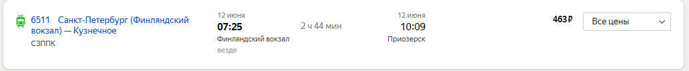

# Общий план
- Даты похода: 12-13-14 июня (2 ночи)
- Количество человек: 7
- Кол-во палаток: 3 (3+3+2)
- Лодки:

| Название | Кол-во людей в лодке | Кол-во лодок |
| -------- | -------------------- | ------------ |
| Фофан    | 3                    | 1            |
| Пелла    | 2                    | 2            |

0. Заранее арендуем лодку (по моим прикидкам аренда 3 лодок обойдется примерно в 12к руб, что меньше 2к с человека - в целом ок)
1. Добираемся до ст. Приозерск (электричка / машина)

(если у вас актуален студенческий, то будет скидка 50%)

2. Грузимся в лодки
3. Плывём до 18:00 или до тех пор пока не найдём место на три палатки. Это может быть проблематично
4. Как только находим место - швартуемся и разбиваем лагерь
5. Жарим мясо
6. П.И.В.О. (Походный Источник Веселья и Отдыха)
7. Спать
8. На второй день отдых, рыбалка, чипсы, пиво, купание (будет холодно) **ЛИБО** переезжаем на другое место. Можно устроить экспедицию на соседние острова 
9. На третий день встаем как можно раньше и выдвигаемся в обратную сторону. Как правило дорога обратно занимает меньше

---

# Общее снаряжение

| Название              | Ответственный |
| --------------------- | ------------- |
| Палатка (3 места)     | Миша          |
| Палатка (2 места)     | Серега        |
| Палатка (2 места)     | Миша          |
| Турбопечь-щепочница   | Миша          |
| Горелка газовая       | Миша          |
| Баллон газа (4 штуки) |               |
| Решетка для мяса      |               |
| Котёл 1 (1.2 л)       | Миша          |
| Котёл 2 (? л)         |               |
| Топор                 | Миша          |
| Пила                  |               |
| Спички / зажигалка    |               |
| Твёрдый розжиг        |               |
| Воронка               |               |

---

# Личное снаряжение

| Название                                          | Комментарий                                                                                                                                                                                                    |
| ------------------------------------------------- | -------------------------------------------------------------------------------------------------------------------------------------------------------------------------------------------------------------- |
| Рюкзак / сумка                                    | в идеале гермомешки: [пример на ozon](https://www.ozon.ru/product/germomeshok-40l-siniy-sinotop-tm0211001-1914177216/?at=PjtJ1O77vcPjrqn0sKR76qwi8JoYRpIBJOWkwUPLnRmm)                                         |
| Накидка на рюкзак                                 | Чтобы в случае дождя сумка не промокла                                                                                                                                                                         |
| Большой полиэтиленовый пакет                      | вложить внутрь рюкзака                                                                                                                                                                                         |
| Спальный мешок                                    | дабы спать на земле русской                                                                                                                                                                                    |
| Коврик (пенка)                                    | дабы лежать на земле русской                                                                                                                                                                                   |
| Сидушка (пендель)                                 | дабы сидеть на земле русской                                                                                                                                                                                   |
| Перчатки                                          | рабочие                                                                                                                                                                                                        |
| Ботинки/кроссовки                                 | (в прошлый раз не понадобились)                                                                                                                                                                                |
| **Тапочки резиновые**                             | **!ВАЖНО!** без тапок будет хуева. В идеале что-то типо кроксов                                                                                                                                             |
| Фонарь налобный                                   | проверить батарейки                                                                                                                                                                                            |
| Носки (теплые / обычные)                          |                                                                                                                                                                                                                |
| Брюки/штаны + шорты                               |                                                                                                                                                                                                                |
| Плавки + полотенце                                | на случай купи-купи                                                                                                                                                                                            |
| Нижнее белье                                      | трусики                                                                                                                                                                                                        |
| Футболки/рубашки                                  |                                                                                                                                                                                                                |
| Кепка                                             | Или любой другой головной убор для защиты от солнца                                                                                                                                                            |
| Теплая вещь                                       | Флиска, свитер или кофта с высоким воротом                                                                                                                                                                     |
| Накидка от дождя на себя                          | дождевик                                                                                                                                                                                                       |
| Аптечка индивидуальная                            | см. ниже в отдельной табличке                                                                                                                                                                                  |
| Нож                                               | Острый!                                                                                                                                                                                                        |
| Жорик                                             | Пластиковая кружка, ложка(вилка), пластиковая миска                                                                                                                                                            |
| Гигиенический набор                               | Мыло, туалетная бумага, зубная щетка и паста, носовые платки, влажные салфетки                                                                                                                                 |
| Спички/зажигалка                                  |                                                                                                                                                                                                                |
| водонепроницаемый пакет для документов и телефона | типо такого: [ozon](https://www.ozon.ru/product/komplekt-2-sht-vodonepronitsaemyy-chehol-dlya-telefona-universalnyy-so-shnurkom-vodonepronitsaemyy-944070910/?at=99trWv55RtqRg31LFB42R59u1vOX3xF95vzBEFPLNRLO) |
| Солнцезащитные очки                               |                                                                                                                                                                                                                |
| Пшикалка(-и) от комаров и клещей                  | **!Важно!**                                                                                                                                                                                                    |
| Бутылка для воды                                  | 1л                                                                                                                                                                                                             |
| наличные деньги на всякий                         | ~2000 р                                                                                                                                                                                                        |
| Павербанк                                         |                                                                                                                                                                                                                |
| Дезодорант                                        | не нужно брать всем, хотя бы парочку на всех                                                                                                                                                                   |
| Губка                                             | чтобы мыть                                                                                                                                                                                                     |

---

# Еда

**Вода:** 10 по 5 л (либо 9 по 6 л, чем больше бутылка - тем лучше)

Расчет: $\frac{10(кол-во \ бутылок) \times 5 (л)}{7(кол-во \ чел.) \times 2.5(кол-во \ дней)} \approx 2.8 (литра \ на \ человека \ в\ день)$ (на еду и питье)

## Меню
### 1 день
Обед
Ужин
### 2 день
Завтрак
Обед
Ужин
### 3 день
Завтрак
Обед (перекус)

---

# Барная карта
